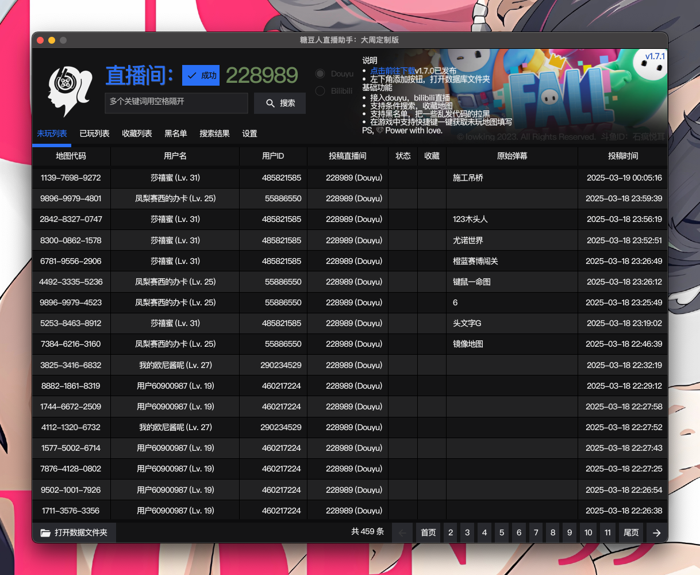

# 运行效果截图

# 项目打包命令
> 本人开发环境mac下的打包命令
```
mac: fyne package -name FallGuys66 -os darwin -icon data/assets/logo-white.png --src ~/FallGuys66/
win: export CGO_ENABLED=1 && export GOOS=windows && export GOARCH=amd64 && export CC=x86_64-w64-mingw32-gcc && go build -ldflags="-s -w -H windowsgui" -o ./build/FallGuys66.exe
```
> PS: 截止2025-03-19目前只能b站的弹幕链接有问题，斗鱼没问题，需要的自行修复